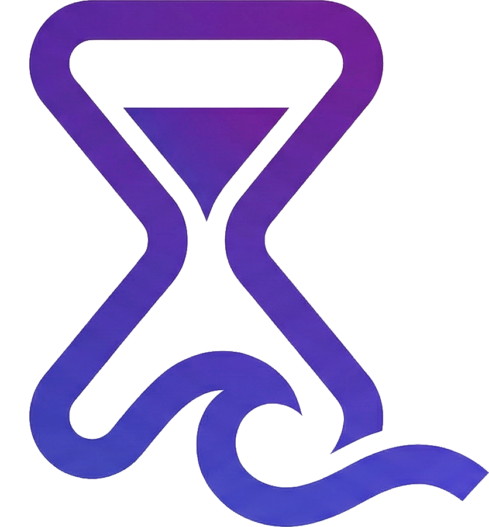
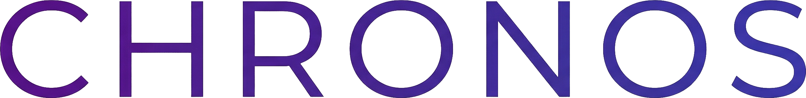



  

 

  

  <i>时间流转，消息随行。</i>

---

基于 QQNT + OneBot11 标准的高性能无签名协议框架。

---

> [!WARNING]
> 在发起 Pull Request 之前，请务必确认：
> 1. 你已熟悉 Zig 语言的基本语法和特性
> 2. 你已了解本项目的整体架构和代码组织方式
> 3. 你的代码已在本地通过编译（`zig build`）
